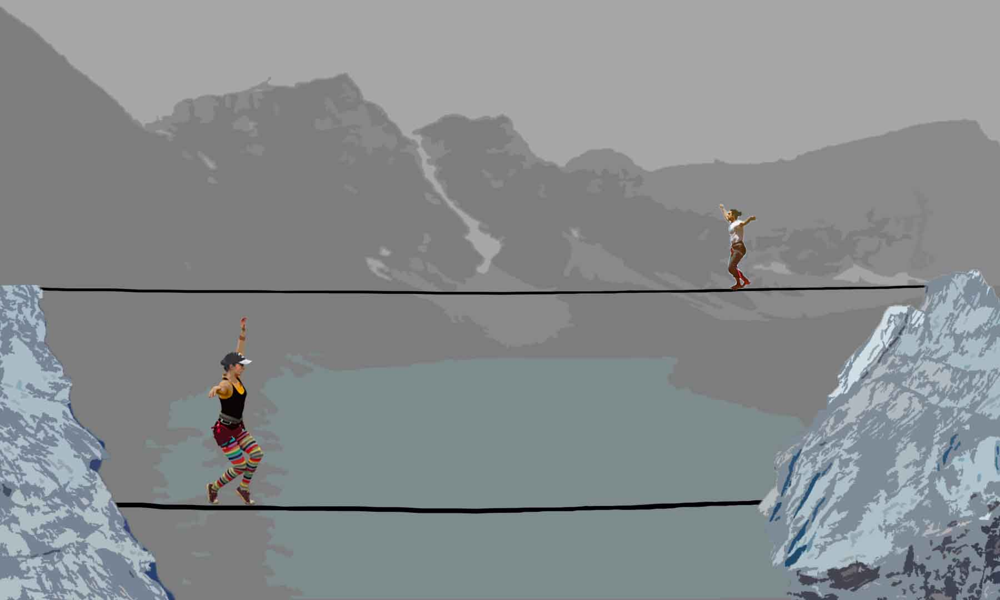

## Final project
### Title: Crossing Lines

## Concept
I would like to create a dynamic animation piece using sprites that I will create in photoshop. My plan is to animate two high-liners to walk across a line that will shift acording to where the slackers are on the line. I want the background to be a p5.js generated landscape of a mountain and lake.
I don't have a particular artist or artwaork that inspired this peice. I was instead inspired by photo's of the American/Irianian Slackline team turned non-profit organization Crossing Lines. High-lining is a visually striking endevor in any context, but what adds significants to crossing lines inparticular is their missoin to find common ground and increase community. The members of the team that I will be animating are Sonya Iverson(USA) and Kiavash Sharifi (Iran).

## Problems to solve
The animation in this progect is more intense than anything we have worked on this semester and I'm expecting that to be quite the feat. I have been watching videos on youtube about creating sprites and it makes sense but I'm nervous about implementing ones I've made myself. I will also need to figure out how to make the line move in sinc with the slackers.
### Rough Sketch

